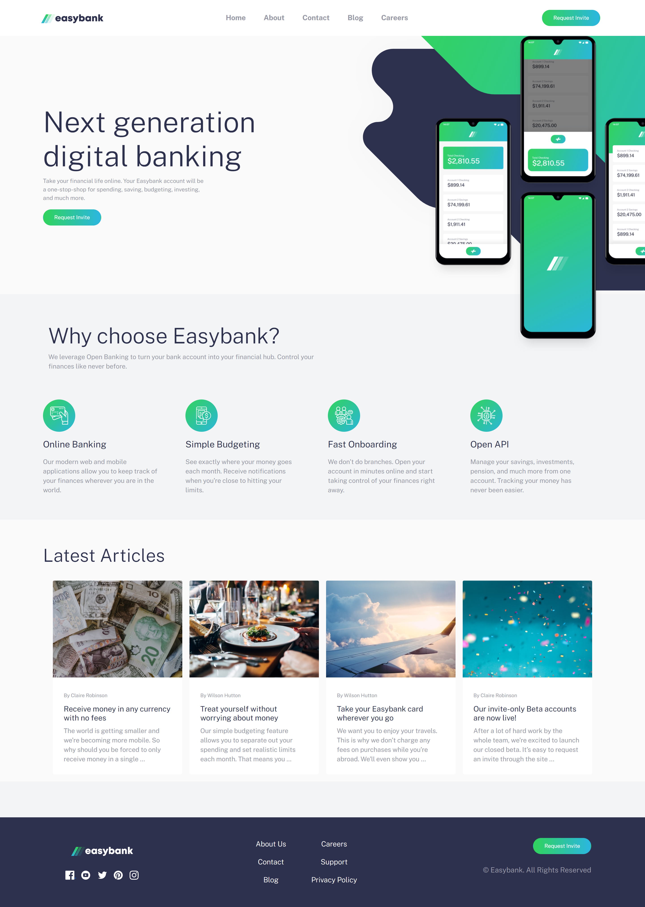

# Frontend Mentor - Easybank landing page solution

This is a solution to the [Easybank landing page challenge on Frontend Mentor](https://www.frontendmentor.io/challenges/easybank-landing-page-WaUhkoDN). Frontend Mentor challenges help you improve your coding skills by building realistic projects. 

## Table of contents

- [Overview](#overview)
  - [The challenge](#the-challenge)
  - [Screenshot](#screenshot)
  - [Links](#links)
- [My process](#my-process)
  - [Built with](#built-with)
  - [What I learned](#what-i-learned)
  - [Challenges](#challenges)
  - [Continued development](#continued-development)
  - [Useful resources](#useful-resources)
- [Author](#author)

## Overview

### The challenge

Users should be able to:

- View the optimal layout for the app depending on their device's screen size
- See hover states for all interactive elements on the page

### Screenshot

### Links

- Solution URL: [Solution](https://github.com/dstrickl7/Bootstrap-Practice/tree/master/easybank%20landing%20page)
- Live Site URL: [Easybank Landing Page](https://dstrickl7.github.io/Bootstrap-Practice/easybank%20landing%20page/)

## My process

### Built with

- Semantic HTML5 markup
- Bootstrap 5
- SCSS
- Javascript

### What I learned
Starting with the grid system would probably have made achieving this layout easier than going back and adding it after I created the HTML skeleton. I tend to use Bootstrap as an afterthought as opposed to building the page with Bootstrap at the same time. This is likely because I got into the habit of creating a skeleton with HTML then going back and styling with CSS or SCSS.

Hover states for SVG icons. I had hoped there was a simple solution for this, but I found that the simplest solution made my HTML really cluttered. I plan to look into SVGs a bit more to understand them better.

I prefer to write my own CSS/SCSS for some things. It seems more efficient to add a class and adjust the style through that than to add individual styling classess to each HTML element.

### Challenges
- The navbar - Normally with CSS or SCSS, I have no issues with navbars, however I really struggled to get the navigation right here. The disconnected mobile navigation was tricky. When I found a solution for mobile, it made the desktop navbar look broken. I also had issues with the padding and positioning to the mobile navigation list. Currently it's added after the list opens causing the content to jump making the effect jarring.

- Hero - on screens between 800-992px, the hero has a lot of white space on the right hand side. On portrait screens with larger widths, there is a lot of white space between the hero and navbar.

Navbar still has a lot of issues:
- ~~On screens of 1024px, it looks very cluttered~~
- Have not managed to fix the jumping when the mobile nav is opened/closed
- ~~When mobile nav is closed, the navlist reverts to being attached to the navbar and closes~~
- Haven't figured out how to smoothly transition between Bootstraps collapse and collapsing classes. This is what caused the previous issues with the mobile nav reattaching to the navbar.

### Continued development
- Use the grid system for more complex layouts
- Figure out how to work around Bootstrap's collapse and collapsing classes or how to adjust the collapse script
- SVGs: styling, etc.

### Useful resources

- [MDN Docs](https://www.example.com) - This is my go to resource for syntax and trying to understand new concepts
- [Bootstrap Docs](https://getbootstrap.com/docs/5.0/getting-started/introduction/) - I was able to use the docs less during this project, but still a very necessary resource

## Author

Danielle S.
- Frontend Mentor - [@dstrickl7](https://www.frontendmentor.io/profile/dstrickl7)
- Website - [Curly Coder](https://www.curlycoder.com)
- Github - [dstrickl7](https://github.com/dstrickl7)
